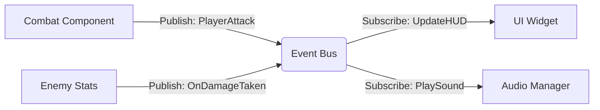

# BlackMyth 🐒

> **同济大学计算机学院软件工程专业 2025-2026 学年《程序设计范式》期末课程项目**
> *一款基于 Unreal Engine 5 C++ 架构开发的高性能、高解耦、数据驱动的第三人称动作角色扮演游戏 (ARPG)。*

---

## 📖 项目介绍 (Introduction)

**BlackMyth** 是一款深度植根于东方神话背景的动作冒险游戏。本项目不仅仅是为了还原“悟空”的战斗体验，更是一个探索现代游戏工业级架构的实践案例。

研发团队严格遵循软件工程标准，采用了**组件化**、**数据驱动** 以及**事件驱动** 的设计范式。通过底层的 C++ 核心架构与 Unreal Engine 的子系统结合，我们构建了一个鲁棒性强、模块间低耦合的战斗与探索框架。

### 核心特性

* **硬核战斗体验**：包含轻/重攻击连招、精准的 Hitbox/Hurtbox 判定、体力/法力资源博弈。
* **智能 AI 系统**：基于行为树与有限状态机的敌人逻辑，包含多阶段 Boss 战。
* **RPG 成长要素**：完整的背包管理、经验升级系统、属性点分配及持久化存档。
* **工业级架构**：高度解耦的子系统设计，支持通过 CSV/DataTable 进行热更新的数值配置。

---

## 🎮 核心玩法 (Gameplay Features)

### ⚔️ 战斗系统 (Combat System)

* **动作连招**：实现了至少 3 段的基础攻击循环，支持输入缓冲与动作锁定机制，确保战斗流畅且具有策略性。
* **精准判定**：摒弃简单的胶囊体碰撞，采用 `UBMHitBoxComponent` 与 `UBMHurtBoxComponent` 进行精确到骨骼的几何体检测。支持弱点打击（如头部伤害倍率 2.0x）。
* **资源管理**：基于 `UBMStatsComponent` 的实时属性管理，攻击、闪避均消耗体力，技能释放消耗法力，要求玩家进行战术决策。

### 🧠 AI 与敌人 (AI & Enemies)

* **分层 AI 架构**：
* **感知层**：基于视觉与听觉的 `AIPerception` 系统。
* **决策层**：使用行为树处理巡逻、追击、攻击权重计算。
* **执行层**：基于 `UBMStateMachineComponent` 驱动的动画状态流转。


* **Boss 战机制**：实现了具备**多阶段** 的 Boss 逻辑。当血量低于阈值时，Boss 会触发转场动画并切换至二阶段行为树，改变攻击频率与技能组合。

### 🎒 系统与交互 (Systems)

* **数据持久化**：支持多槽位存档，完整序列化玩家位置、属性、背包物资及关卡状态。
* **UI 交互**：基于事件总线的 HUD 系统，实时显示血条、技能冷却、伤害数字及系统通知。
* **场景流送**：支持关卡间的平滑切换与动态资源加载。

---

## 🏗️ 系统架构设计 (System Architecture)

本项目严格遵循“高内聚、低耦合”的设计原则，广泛应用了现代 C++ 设计模式。

### 1. 总体架构风格

采用 **"全局子系统 + 角色职能组件"** 的双层架构模式：

* **全局服务层 (Subsystems)**：依托 `GameInstanceSubsystem` 实现单例服务，管理跨关卡生命周期。
* **逻辑执行层 (Components)**：通过组合模式将战斗、属性、状态机挂载于角色基类。

### 2. 核心设计模式

| 模式 | 应用场景 | 实现细节 |
| --- | --- | --- |
| **Component** | 角色功能拆分 | `UBMStatsComponent` (数值), `UBMCombatComponent` (战斗), `UBMInventory` (背包) |
| **Observer** | 模块解耦 | **`UBMEventBusSubsystem`**：UI 层订阅事件，逻辑层发布事件，彻底切断 UI 与战斗逻辑的硬引用。 |
| **Singleton** | 全局管理 | 各类 Subsystem (如 `UBMDataSubsystem`, `UBMUIManagerSubsystem`)。 |
| **Data-Driven** | 数值配置 | 所有技能、敌人属性、掉落物均存储于外部 CSV/DataTable，通过 `UBMDataSubsystem` 动态加载，无需重新编译代码。 |
| **State Machine** | 行为控制 | 自研 `UBMStateMachineComponent`，管理 Idle/Move/Attack/Hit/Death 状态的排他性流转。 |

### 3. 子系统交互图 (Event Bus)



---

## 💻 技术栈与代码规范 (Tech Stack & Standards)

### 开发环境

* **Engine**: Unreal Engine 5.0+
* **IDE**: Visual Studio 2022 
* **Version Control**: Git (Feature Branch Workflow)

### 程序设计范式 (Programming Paradigms)

本项目严格符合课程对 C++ 高级特性的要求：

1. **现代 C++ 特性 (C++17)**：
* 广泛使用 `auto` 进行类型推导。
* 使用 `TObjectPtr<T>` (UE5 标准) 替代裸指针。
* Lambda 表达式用于异步资源加载回调与事件绑定。
* `constexpr` 与 `enum class` 确保类型安全。


2. **内存安全**：
* 利用 UE 反射系统 (Reflection) 与 GC 机制管理对象生命周期。
* UI 系统中使用 `TWeakObjectPtr` 防止循环引用。
* 严格的空指针检查 (`check`, `ensure`) 与防御性编程。


3. **代码规范**：
* 遵循 Google C++ Style Guide 与 UE 编码标准。
* 清晰的目录结构 (Public/Private 分离，按模块划分)。
* 完善的注释文档（类、函数、参数说明）。


---

## 🚀 安装与运行 (Installation)

1. **克隆仓库**
```bash
git clone https://github.com/TangciuYueng/BlackMyth.git

```


2. **生成项目文件**
* 右键点击 `BlackMyth.uproject`。
* 选择 **Generate Visual Studio project files**。


3. **编译项目**
* 打开生成的 `.sln` 文件。
* 将配置设置为 `Development Editor`，平台设置为 `Win64`。
* 点击 Build (Ctrl+Shift+B)。


4. **运行**
* 双击 `BlackMyth.uproject` 打开编辑器。
* 点击编辑器上方的 Play 按钮开始游戏。


---

## 👥 团队分工 (Team)

| 成员 | 角色 | 主要职责 |
| --- | --- | --- |
| **TangciuYueng** | 架构师 / PM | 顶层架构设计、Git 版本管理、子系统开发 (Data/EventBus)、Audio Bug 修复 |
| **Hao Qu** | 核心战斗 | 角色动作系统、技能逻辑、Hitbox/Hurtbox 判定、动画状态机重构 |
| **Hongbin Zhao** | UI/UX | 界面系统架构 (UIManager)、HUD、主菜单/暂停菜单、通知系统实现 |
| **Yifan** | 资源与 AI | 场景搭建、AI 行为树设计、音频资源整合、数据表 (CSV) 填充 |

### 开发时间轴 (Timeline 2025)

* **Nov 30**: 技术选型确定 (Cocos 转 UE5)，环境搭建。
* **Dec 06**: 核心框架搭建完成 (State Machine, Subsystems)，Git 规范确立。
* **Dec 13**: 战斗系统闭环 (Hitbox判定实现)，AI 行为树基础架构。
* **Dec 20**: 逻辑组件完善 (Save/Load, Inventory, Exp)，UI 与事件总线对接。
* **Dec 26**: 功能冻结，Bug 修复，文档汇总与演示准备。

---

### 视频展示（Video Demo）

[](./assets/demo_video.mp4?raw=true)

## 📄 License

This project is licensed under the MIT License - see the [LICENSE](https://www.google.com/search?q=LICENSE) file for details.

---

**致谢**: 感谢同济大学计算机学院提供的课程指导，以及所有开源社区贡献者提供的模型与音效资源。
